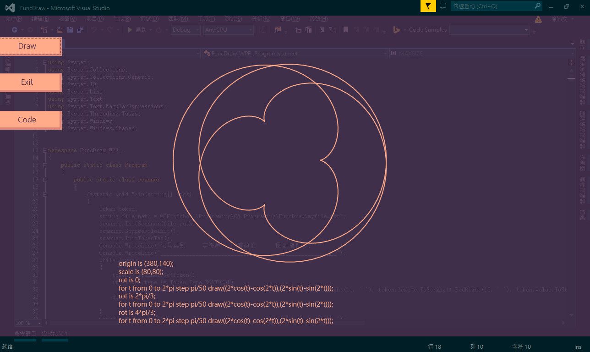

## FuncDrawCompiler

- This is a FuncDraw Compiler with C# in WPF
If you anyone have problems or advice for this, please give me a contact. I just want to learn more!

- Imagine that how beautiful the pictrue drawn by mathematical expressions.

## Usage

- Just run the `FuncDraw(WPF).exe` in `bin/Debug/` (*Notice: cause there is bug to fix, you can only draw once in the program, or it will break down when drawing in another time*)

**i.** First, we can see the main grid of the software.

**ii.** We can input your expressions, which you can use example txt files in the directory, 'example', by clicking the button 'Code'.

**iii.** Now, we can click the button 'Draw' to see how awesome things we have created.

